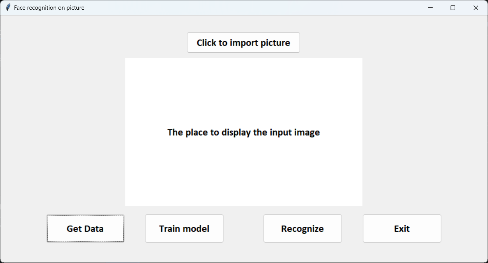
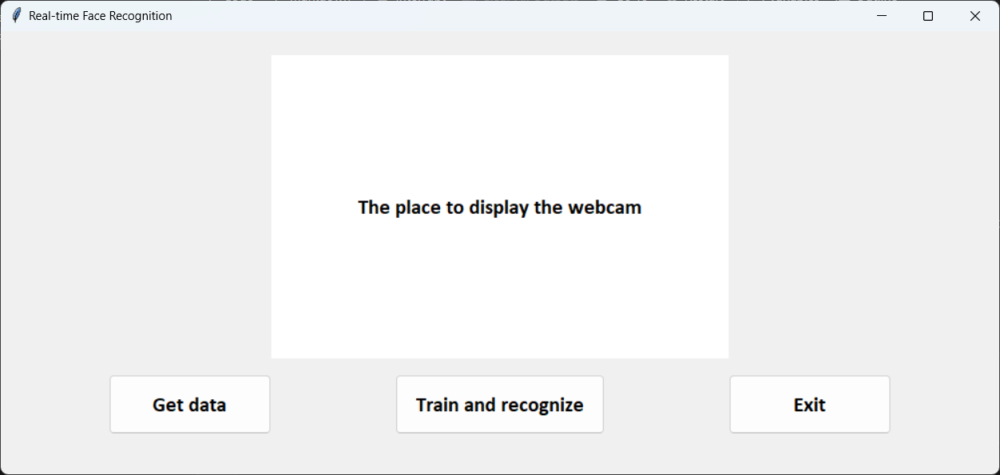

# Face recognition with GUI
 Face Recognition on a Photo and in Realtime Webcam using Dlib and OpenCV with GUI 

 Files:
  - FaceRecognition.ipynb (source code)
  - haarcascade_frontalface_default.xml (pre-trained model)  
  
  Folders:
  - Models (contains the trained model and pre-trained Haar Cascade model)
  - dataset (contains the data that has been collected)  

 How to use:
 -  Clone the project and run FaceRecognition.ipynb
 -  Collect data by clicking the 'Get Data' button
 -  (Data will be save in the *dataset* folder)
 -  Train the model by clicking the 'Train Model' or 'Train and recognize'
 -  Choose a picture for recognition
 -  Perform recognition either through the selected picture or using the webcam.  

